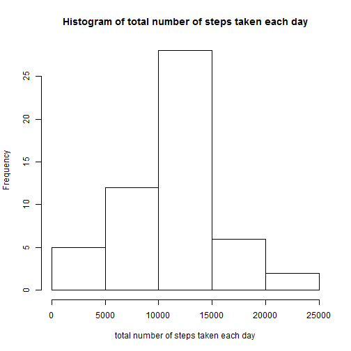
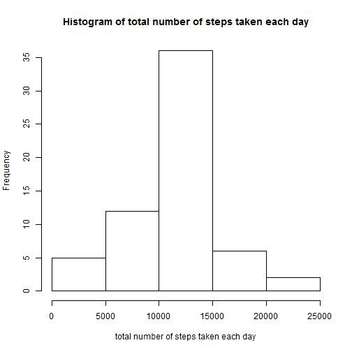
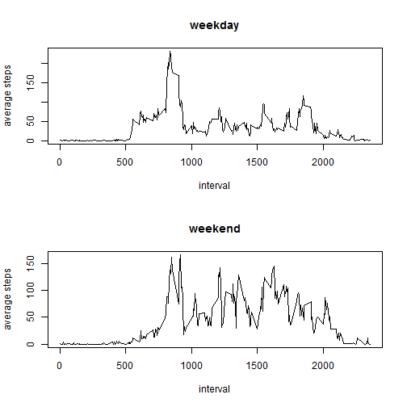

---
html_document:
author: "Sushrut Shendre"
date: "August 6, 2017"
keep_md: true
title: "ReproducibleResearch"
output: html_document
---


## Loading and preprocessing the data


```r
activity <- read.csv("C:/Users/Sushrut/datasciencecoursera/datasciencecoursera/RepData_PeerAssessment1/activity/activity.csv")
```

## What is mean total number of steps taken per day?

The dataframe 'd' groups the steps by date using the aggregate function. 


```r
d <- aggregate(activity$steps ~ activity$date,data = activity, FUN=sum)
colnames(d) <- c("date", "steps")
```

Histogram of total number of steps taken per day is made.


```r
hist(d$steps, xlab="total number of steps taken each day", main = "Histogram of total number of steps taken each day")
```



Mean and median


```r
mean_steps <- mean(d$steps)
mean_steps
```

```
## [1] 10766.19
```

```r
median_steps <- median(d$steps)
median_steps
```

```
## [1] 10765
```

## What is the average daily activity pattern?

The dataframe 'e' groups the number of steps taken by the interval.


```r
e <- aggregate(activity$steps ~ activity$interval,data = activity, FUN=mean)
colnames(e) <- c("interval","avg_steps")
```

time series plot of the 5-minute interval (x-axis) and the average number of steps taken, averaged across all days (y-axis)


```r
plot(e$interval, e$avg_steps, type = "l", xlab = "interval", ylab = "average steps")
```


Finding the 5-minute interval which contains the maximum number of steps


```r
index <- which(e$avg_steps == max(e$avg_steps))
best_5_min_interval <- e$interval[index]
best_5_min_interval
```

```
## [1] 835
```

## Imputing missing values

Calculating the total number of missing values in the data


```r
f <- activity[is.na(activity$steps),]
no_of_NA <- nrow(f)
no_of_NA
```

```
## [1] 2304
```

creating a new dataset and filling the NA values with the respective average steps for that interval for which the steps row was NA


```r
activity2 <- activity
for (i in 1:nrow(activity2)){
  if (is.na(activity2$steps[i])){
    activity2$steps[i] <- e$avg_steps[which(e$interval == activity2$interval[i])]
  }
}
```

Making a new dataframe 'g' so as to group the steps taken by date and making the histogram and finding means and medians


```r
g <- aggregate(activity2$steps ~ activity2$date,data = activity2, FUN=sum)
colnames(g) <- c("date", "steps")
hist(g$steps, xlab="total number of steps taken each day", main = "Histogram of total number of steps taken each day")
```



```r
mean_NA_included <- mean(g$steps)
mean_NA_included
```

```
## [1] 10766.19
```

```r
median_NA_included <- median(g$steps)
median_NA_included
```

```
## [1] 10766.19
```

We see that mean remains same whereas median changes.

## Are there differences in activity patterns between weekdays and weekends?

Using the weekdays() function to assign days and then grouping them into either 'weekday' or 'weekend'. 


```r
df_weekday3 <- as.data.frame(weekdays(as.Date(activity2$date)))
df_weekday3 <- gsub("Monday","weekday", as.data.frame(df_weekday3)[,1])
df_weekday3 <- gsub("Tuesday","weekday", as.data.frame(df_weekday3)[,1])
df_weekday3 <- gsub("Wednesday","weekday", as.data.frame(df_weekday3)[,1])
df_weekday3 <- gsub("Thursday","weekday", as.data.frame(df_weekday3)[,1])
df_weekday3 <- gsub("Friday","weekday", as.data.frame(df_weekday3)[,1])
df_weekday3 <- gsub("Saturday","weekend", as.data.frame(df_weekday3)[,1])
df_weekday3 <- gsub("Sunday","weekend", as.data.frame(df_weekday3)[,1])
df_weekday3 <- as.data.frame(df_weekday3)
activity3 <- cbind(activity2,df_weekday3)
```

splitting the dataframe by the factor whether it is a weekday or weekend and applying aggregate function to find average steps per interval for both


```r
X <- split(activity3, activity3$df_weekday3)
weekday <- X[[1]]
weekend <- X[[2]]

j <- aggregate(steps ~ interval, data = weekday,FUN = mean)
k <- aggregate(steps ~ interval, data = weekend,FUN = mean)
colnames(j) <- c("interval","avg_steps")
colnames(k) <- c("interval","avg_steps")
```


panel plot containing a time series plot of the 5-minute interval (x-axis) and the average number of steps taken, averaged across all weekday days or weekend days (y-axis)


```r
par(mfrow = c(2,1))
plot(j$interval, j$avg_steps, type = "l", xlab = "interval", ylab = "average steps",main = "weekday")
plot(k$interval, k$avg_steps, type = "l", xlab = "interval", ylab = "average steps",main = "weekend")
```



As can be seen from the plots, there is difference between weekday and weekend activities. There is inclination towards more activity in the midday time during weekends than on weekdays, the reason of which can be attributed to the fact that the person probably has office on weekdays but not on weekends.
